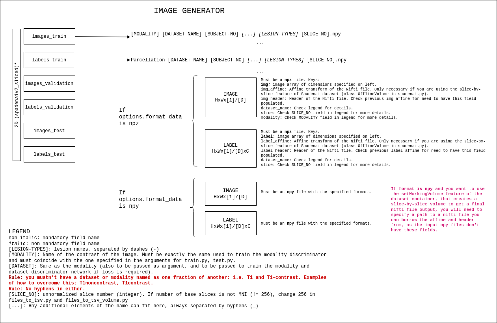

# brainSPADE23D

## Data format for the images

The data can be in npz or npy format. This is adjusted through the field format_data in the base options. The data that we used was created based on niftis (we used nibabel 4.0.2), and pre-registered to MNI space using AntsPy. The reference registration file was: *mni_icbm152_nlin_sym_09a_nifti.zip*.  The labels must be in a one-hot-encoded format, and should have float values. Ideally, they should be probabilistic partial volume maps (that sum to 1.0 along the channel direction), but you can use binary parcellations, as long as they are one-hot encoded and the sum across the channel dimension does not exceed 1.0. To create our labels, we used GIF (https://pubmed.ncbi.nlm.nih.gov/25879909/). 

More details of the format of the data can be seen in this infographic.

## Training the modality and dataset discriminator

If you want to use our custom modality-dataset discrimination loss to train the image generator (mod_disc flag in the options), you need to pre-train the network on your real data: for that, you need to make sure the names of the image files are compliant with the nomenclature specified in the infographics above in the "Data Format" section. The options to train the network are accessible in: options/modisc_options. You can instance ModiscOptions and use the function <help> to see all the options.

## Training the label generator

Due to the release of MONAI Generative Models in the course of this project, the 2D label generator was trained using a different code from the 3D one.
The codes have the exact same hyperparameters and dynamics, but are located in different folders.
- 2D: conditioned_ldm. To train the autoencoder, conditioned_ldm>src>python>training_and_testing>train_aekl_no_attention_3d.
  Sample configuration file is available at conditioned_ldm>configs>stage1. To train the autoencoder, train_ldm_v2_conditioned_pv.
  Again, config files are available in conditioned_ldm>configs>diffusion. 
- 3D: use git pull https://github.com/Project-MONAI/GenerativeModels.git to retrieve the MONAI Generative Models repository [1].
  Don't forget to mark it as root, to ensure that you can do imports such as "from generative.[STUFF]".
  Then, call conditioned_ldm_3D>train_autoencoder.py for the VAE (stage 1) and conditioned_ldm_3D>train_ldm for the LDM.
  Configuration examples are available in conditioned_ldm_3D > configs.  
   
Both 2D and 3D approaches are designed to read data from a CSV with the following columns: (label): path to label,
(disease_1): float value indicating the proportion of this lesion, (disease_2): float value indicating the proportion of this lesion etc.
In the 2D one, (slice_no) must be present if you want to work with slice number conditioning. Both disease and slice number conditioning can be deactivated in the configuration.
All the flags are detailed in the argparse option definition on both scripts.

##Training the image generator

Working in the same fashion as the codebase used for this application (https://github.com/NVlabs/SPADE.git), you can access all options available by instancing BaseOptions (options > base_options.py) and TrainOptions (options > train_options.py), using the function help.
Most of the original SPADE options have been re-defaulted to values that we used for our work (such as the normalization type). 

To run the training, call train.py. Example configuration is available in options > sample_config_SPADE.txt.
 
 
The code for this paper / work is entirely based on the code for SPADE [2], with additions from the authors, and with the inclusion of code from
MONAI Generative models [1].

[1] Pinaya, W. H. L., Graham, M. S., Kerfoot, E., Tudosiu, P.-D., Dafflon, J., Fernandez, V., Sanchez, P., Wolleb, J., da Costa, P. F., Patel, A., Chung, H., Zhao, C., Peng, W., Liu, Z., Mei, X., Lucena, O., Ye, J. C., Tsaftaris, S. A., Dogra, P., … Cardoso, M. J. (2023). Generative AI for Medical Imaging: extending the MONAI Framework. https://arxiv.org/abs/2307.15208v1
[2] Park, T., Liu, M.-Y., Wang, T.-C., & Zhu, J.-Y. (2019). Semantic Image Synthesis with Spatially-Adaptive Normalization. Proceedings of the IEEE Conference on Computer Vision and Pattern Recognition.